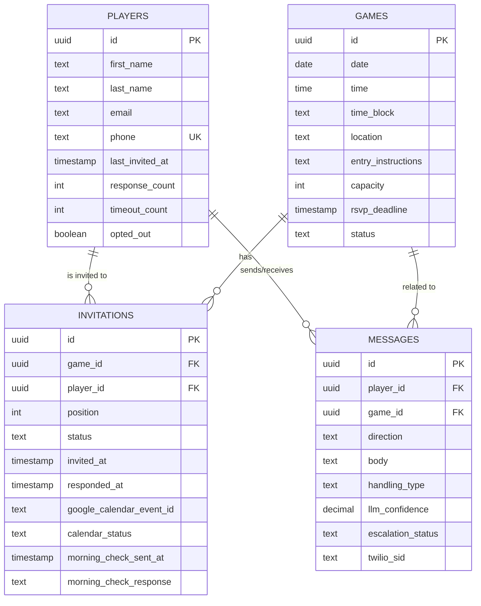
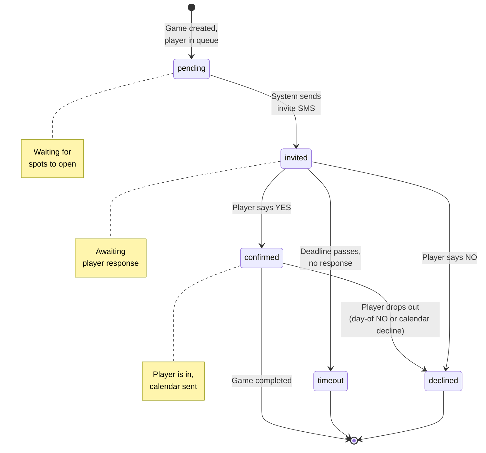
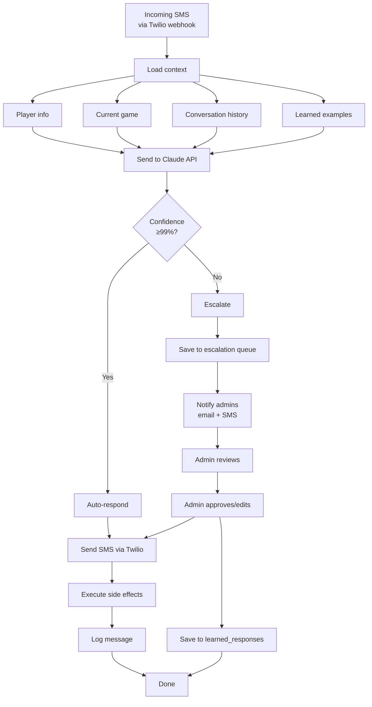
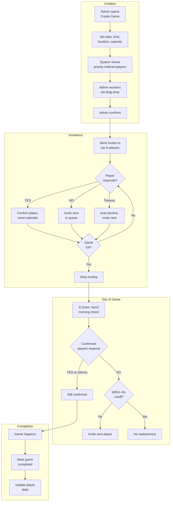
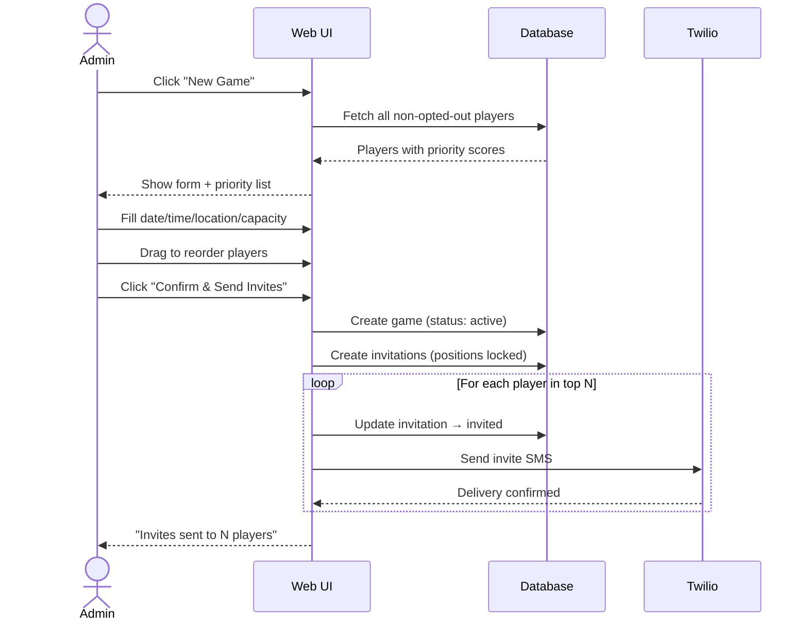
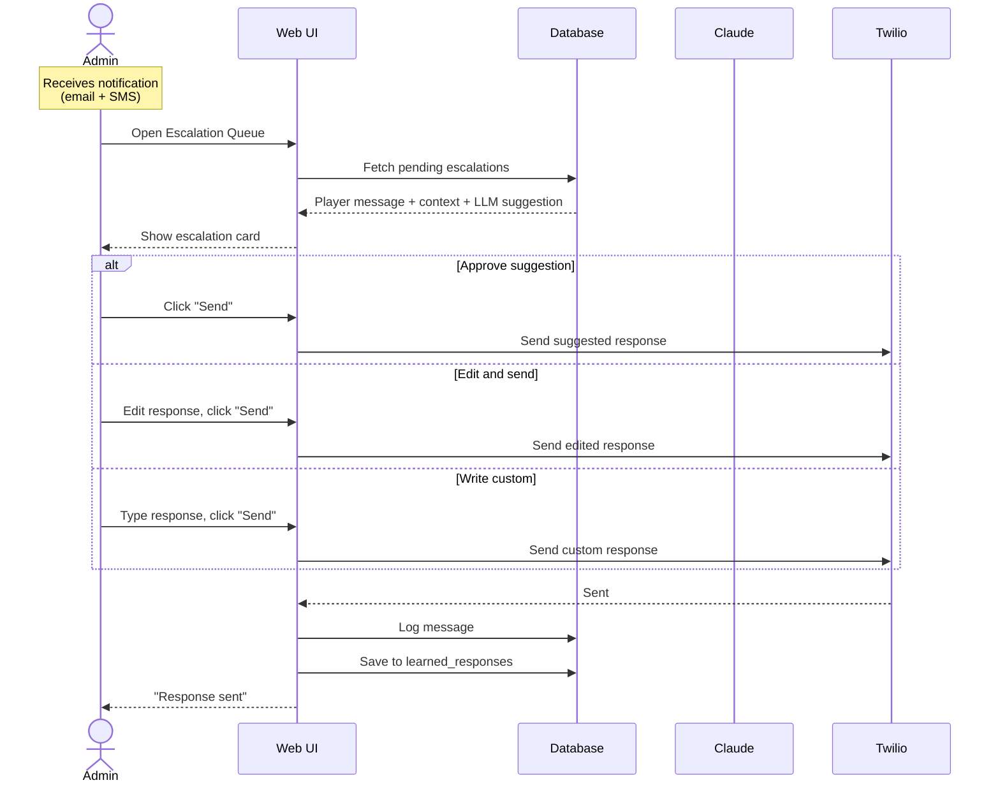
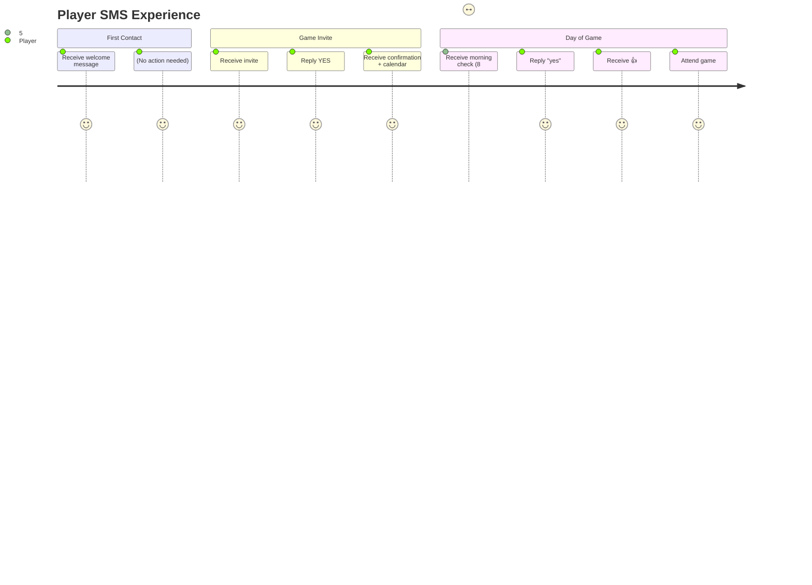

# PokerList - Technical Specification

---

## Database Schema

**4 tables total.** Learned responses are versioned in code, not DB.

### Players
```sql
CREATE TABLE players (
  id              UUID PRIMARY KEY DEFAULT gen_random_uuid(),
  first_name      TEXT NOT NULL,
  last_name       TEXT NOT NULL,
  email           TEXT NOT NULL,
  phone           TEXT NOT NULL UNIQUE,    -- E.164 format: +14155551234

  -- Stats for priority algorithm (updated after each game)
  last_invited_at TIMESTAMPTZ,
  response_count  INT DEFAULT 0,           -- Times they said YES or NO
  timeout_count   INT DEFAULT 0,           -- Times they failed to RSVP

  opted_out       BOOLEAN DEFAULT FALSE,

  created_at      TIMESTAMPTZ DEFAULT NOW(),
  updated_at      TIMESTAMPTZ DEFAULT NOW()
);

CREATE INDEX idx_players_phone ON players(phone);
CREATE INDEX idx_players_opted_out ON players(opted_out);
```

### Games
```sql
CREATE TABLE games (
  id                  UUID PRIMARY KEY DEFAULT gen_random_uuid(),

  -- When
  date                DATE NOT NULL,
  time                TIME NOT NULL,
  time_block          TEXT NOT NULL,       -- e.g., "Arrive 6:30-7; cards at 7"

  -- Where
  location            TEXT NOT NULL,       -- e.g., "Mux office (Market & 2nd)"
  entry_instructions  TEXT,                -- e.g., "Buzz 42, take elevator to 5th floor"

  -- Capacity & deadline
  capacity            INT NOT NULL DEFAULT 10,
  rsvp_deadline       TIMESTAMPTZ NOT NULL,

  -- Status: draft → active → completed | cancelled
  status              TEXT NOT NULL DEFAULT 'draft',

  created_at          TIMESTAMPTZ DEFAULT NOW(),
  updated_at          TIMESTAMPTZ DEFAULT NOW(),

  CONSTRAINT valid_status CHECK (status IN ('draft', 'active', 'completed', 'cancelled'))
);

CREATE INDEX idx_games_status ON games(status);
CREATE INDEX idx_games_date ON games(date);
```

### Invitations
```sql
CREATE TABLE invitations (
  id              UUID PRIMARY KEY DEFAULT gen_random_uuid(),
  game_id         UUID NOT NULL REFERENCES games(id) ON DELETE CASCADE,
  player_id       UUID NOT NULL REFERENCES players(id) ON DELETE CASCADE,

  -- Priority position (1 = first to invite)
  position        INT NOT NULL,

  -- Status: pending → invited → confirmed | declined | timeout
  status          TEXT NOT NULL DEFAULT 'pending',

  -- Response tracking
  invited_at      TIMESTAMPTZ,             -- When invite SMS was sent
  responded_at    TIMESTAMPTZ,             -- When they replied

  -- Google Calendar integration
  google_calendar_event_id  TEXT,          -- Event ID for decline detection
  calendar_status           TEXT,          -- 'pending' | 'accepted' | 'declined'

  -- Morning-of confirmation (8:15am check)
  morning_check_sent_at     TIMESTAMPTZ,
  morning_check_response    TEXT,          -- 'confirmed' | 'dropped' | null

  created_at      TIMESTAMPTZ DEFAULT NOW(),
  updated_at      TIMESTAMPTZ DEFAULT NOW(),

  UNIQUE(game_id, player_id),
  UNIQUE(game_id, position),
  CONSTRAINT valid_invitation_status CHECK (status IN ('pending', 'invited', 'confirmed', 'declined', 'timeout')),
  CONSTRAINT valid_calendar_status CHECK (calendar_status IN ('pending', 'accepted', 'declined') OR calendar_status IS NULL)
);

CREATE INDEX idx_invitations_game_id ON invitations(game_id);
CREATE INDEX idx_invitations_player_id ON invitations(player_id);
CREATE INDEX idx_invitations_status ON invitations(status);
```

### Messages
```sql
CREATE TABLE messages (
  id              UUID PRIMARY KEY DEFAULT gen_random_uuid(),
  player_id       UUID NOT NULL REFERENCES players(id) ON DELETE CASCADE,
  game_id         UUID REFERENCES games(id) ON DELETE SET NULL,

  -- Content
  direction       TEXT NOT NULL,           -- 'inbound' | 'outbound'
  body            TEXT NOT NULL,

  -- LLM handling
  handling_type   TEXT,                    -- 'auto' | 'escalated' | 'admin'
  llm_confidence  DECIMAL(3,2),            -- 0.00 to 1.00, for inbound only
  escalation_status TEXT,                  -- 'pending' | 'resolved' | null

  -- Twilio
  twilio_sid      TEXT,

  sent_at         TIMESTAMPTZ NOT NULL,
  created_at      TIMESTAMPTZ DEFAULT NOW(),

  CONSTRAINT valid_direction CHECK (direction IN ('inbound', 'outbound')),
  CONSTRAINT valid_handling CHECK (handling_type IN ('auto', 'escalated', 'admin') OR handling_type IS NULL),
  CONSTRAINT valid_escalation CHECK (escalation_status IN ('pending', 'resolved') OR escalation_status IS NULL)
);

CREATE INDEX idx_messages_player_id ON messages(player_id);
CREATE INDEX idx_messages_game_id ON messages(game_id);
CREATE INDEX idx_messages_sent_at ON messages(sent_at);
CREATE INDEX idx_messages_escalation ON messages(escalation_status) WHERE escalation_status = 'pending';
```

### Learned Responses (Versioned in Code)

Not a database table. Stored as `src/data/learned-responses.json`:

```json
[
  {
    "pattern": "can i bring a friend",
    "intent": "guest_request",
    "response": null,
    "action": "escalate"
  },
  {
    "pattern": "i'll be late",
    "intent": "late_arrival",
    "response": "No problem, see you when you get there.",
    "action": "auto_respond"
  }
]
```

Updated via PRs, reviewed before merge.

---

## Entity Relationship Diagram



---

## Invitation State Machine



---

## SMS Processing Flow



---

## Game Lifecycle Flow



---

## Admin UX Flows

### Flow 1: Create a Game



### Flow 2: Handle Escalation



---

## Player SMS Journey



---

## API Routes

### Public (Webhooks)
```
POST /api/webhooks/twilio/sms     # Incoming SMS from Twilio
POST /api/webhooks/google/calendar # Calendar event updates
```

### Admin (Auth Required)
```
# Auth
POST /api/auth/login              # Password login
POST /api/auth/logout             # Clear session

# Games
GET    /api/games                 # List all games
POST   /api/games                 # Create game
GET    /api/games/:id             # Get game details
PATCH  /api/games/:id             # Update game
DELETE /api/games/:id             # Cancel game
POST   /api/games/:id/confirm     # Confirm player list, send invites

# Players
GET    /api/players               # List all players
POST   /api/players               # Add player
GET    /api/players/:id           # Get player details
PATCH  /api/players/:id           # Update player
DELETE /api/players/:id           # Remove player

# Invitations
GET    /api/games/:id/invitations # Get invitations for game
PATCH  /api/invitations/:id       # Update invitation (manual override)
POST   /api/invitations/:id/invite # Manually trigger invite

# Messages
GET    /api/messages              # List all messages (with filters)
GET    /api/players/:id/messages  # Messages for a player
POST   /api/messages              # Admin sends message

# Escalations
GET    /api/escalations           # Pending escalations
POST   /api/escalations/:id/respond # Admin responds to escalation

# Priority
GET    /api/games/:id/priority    # Get priority-ordered player list
POST   /api/games/:id/priority    # Save reordered list
```

### Cron Jobs (Vercel Cron)
```
POST /api/cron/morning-check      # 8:15am PT - send day-of confirmations
POST /api/cron/deadline-check     # Hourly - process expired deadlines
POST /api/cron/calendar-sync      # Every 15min - check calendar declines
```

---

## Page Wireframes (Descriptions)

### Dashboard
- Header: "PokerList" + logout button
- Active game card (if exists):
  - Date, time, location
  - Progress: "7/10 confirmed"
  - Quick stats: X pending, Y declined
  - Link to Active Game View
- Escalation alert (if pending): "3 messages need response"
- Recent activity feed

### Create Game
- Form fields:
  - Date picker
  - Time input
  - Time block textarea (e.g., "Arrive 6:30-7; cards at 7")
  - Location (pre-filled with default)
  - Capacity (default 10)
  - RSVP deadline (date + time picker)
- Priority list:
  - Sortable list of players
  - Each row: Name, last invited date, response rate
  - Drag handles to reorder
  - Line between "will invite" and "waitlist"
- Confirm button

### Active Game View
- Game details header
- Three columns:
  - Confirmed (green): List of confirmed players
  - Pending (yellow): Invited, awaiting response
  - Queue (gray): Not yet invited
- Timeline of events (invite sent, response received, etc.)
- Manual actions: "Invite next", "Mark as declined"

### Escalation Queue
- List of cards, each showing:
  - Player name + phone
  - Their message
  - Context: game status, their invitation status
  - LLM suggested response (editable textarea)
  - Buttons: "Send" / "Send & Learn"

### Player Roster
- Table: Name, Phone, Email, Last Invited, Response Rate, Status
- Filters: All / Active / Opted Out
- Add player form (slide-out or modal)
- Row actions: Edit, Remove

### Game History
- List of past games
- Each row: Date, # confirmed, # declined, # timeout
- Click to expand: See full invitation list with outcomes

---

*Last updated: Feb 15, 2025*
